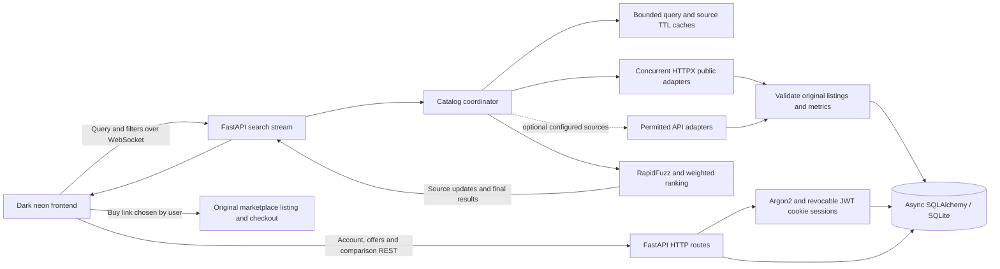
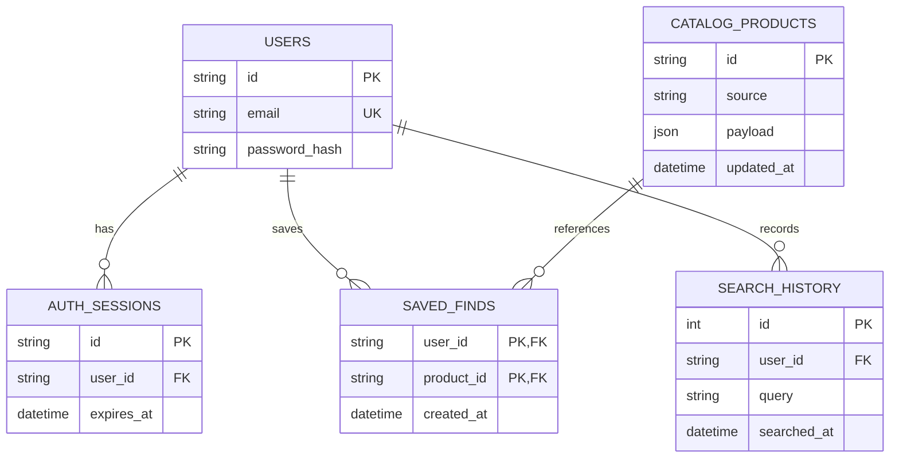

# NeonFind architecture

Discovery starts empty. The backend fetches and persists source records before emitting product updates. Public access restrictions remain source errors; healthy sources are retained. Checkout is external to NeonFind. Ranking/filtering/currency conversion occur on the server; the UI renders the response.

Offers, source metrics and overview information are embedded in the catalog JSON payload. Search uniqueness is scoped to user/query. Saved finds reference stable discovered listing IDs. Public adapters keep separate listing identities, while configured API adapters may provide verified canonical identity mappings. See [live-search details](LIVE_SEARCH.md).

## Source expansion and quality eligibility

Daraz, Amazon, AliExpress and Audionic Shopify are default public sources; Alibaba reports access restrictions when needed. Configured Shopify shops have independent source IDs, provider caches and progress entries. Public Shopify predictive search is followed by bounded HTML lookups for overview and product-specific review widgets/JSON-LD; optional card/badge selectors require an exact product link before accepting a published sales label.

minRating and minSales are validated backend filters. Eligibility applies to source offers before choosing the Buy link; unknown metrics fail active minima. The UI defaults to 4 stars/100 sales and best-selling ranking (relevance 25%, rating 30%, sales 30%, reviews 10%, price value 5%). Sales groups for Shopify are separated by domain. Checkout stays on the original merchant website.
